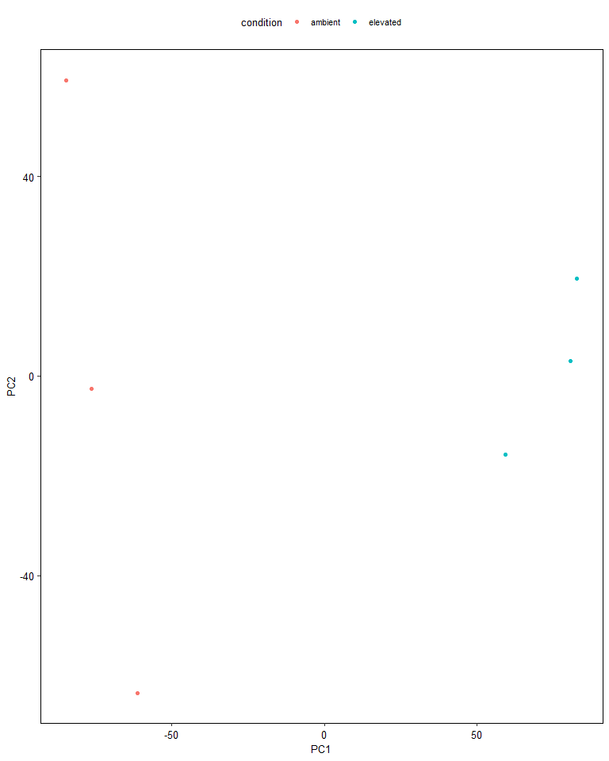
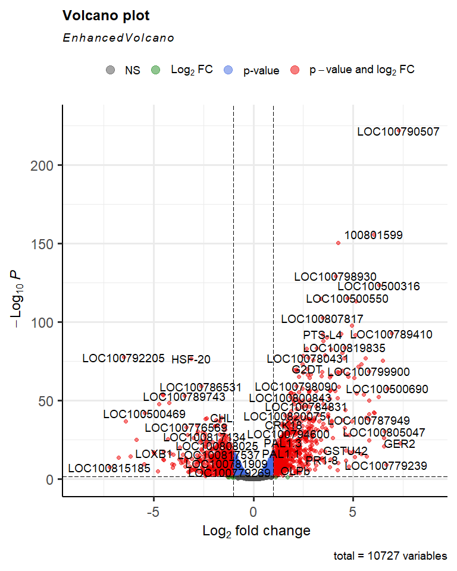

Downstream analyses
================
Jack Gisby
2022-06-14

-   [Loading the data](#loading-the-data)
-   [Unsupervised analysis and
    visualisation](#unsupervised-analysis-and-visualisation)
    -   [Principal components analysis](#principal-components-analysis)
-   [Differential expression](#differential-expression)

This markdown document shows how we can perform basic downstream
analysis on raw RNA-seq counts. These counts were produced by the data
processing pipeline developed in this repository applied to RNA-seq
reads measured from soybean plants grown at ambient or elevated ozone
levels. If you want to learn more about the preprocessing pipeline, see
the documents describing its development in the `docs/` directory.

The raw counts files are a lot smaller than the original reads (that
were stored in fasta files). They are small enough that we can read the
raw counts into R on a standard home computer. After normalising the raw
counts data, we will perform some basic analyses to investigate the
transcriptome of the soybean samples.

# Loading the data

We load the names of the samples from `data/files.txt` into
`sample_names` before extracting the raw counts for each sample. There
is a counts file for each sample, but it would be more convenient to
group these together into a single data matrix. Each of these files
contains two columns; the first represents gene IDs and the second
indicates how many of the reads for that sample mapped to that gene.

We first create a dataframe, `counts`, that contains a single column:
the gene IDs that we extract from the counts file for the first sample
(SRR391535).

Then, we loop through each of the samples, reading in that sample’s
count file and merging them into the matrix `counts`. Finally, we can
see that we have created a single matrix describing how many reads map
to each gene for each sample.

``` r
# get the sample names
sample_names <- read.csv("../data/files.txt", header = FALSE)[[1]]

# a dataframe for all of the counts
counts <- data.frame(gene_id = fread("../3_nextflow_pipeline_results/g_count/SRR391535.counts")[[1]])

# for each sample
for (s in sample_names) {
    
    # get the counts from htseq
    sample_counts <- fread(paste0("../3_nextflow_pipeline_results/g_count/", s, ".counts"))
    colnames(sample_counts) <- c("gene_id", s)
    
    # remove counts for reads that did not map to a gene
    sample_counts <- sample_counts[which(!grepl("__", sample_counts[[1]])) ,]
    
    # merge with the main dataframe
    counts <- merge(counts, sample_counts, by = "gene_id")
}

# move the gene_id column to the rownames
rownames(counts) <- counts$gene_id
counts <- subset(counts, select = -gene_id)

# view the combined matrix
print(head(counts))
```

    ##           SRR391535 SRR391536 SRR391537 SRR391538 SRR391539 SRR391541
    ## 1-3-1A           87        41        59        88        79        98
    ## 1-3-1B          242       150       212       289       249       288
    ## 100801599        22         9       859      1455      1421        24
    ## 100805863         0         0         0         0         0         0
    ## 13-1-1          110        39       163       121       284       194
    ## 14-1-1           21        26        65        14        63        33

In the following chunk, we create a dataframe, `sample_names`,
describing the condition for each of the samples. Three of the samples
were grown at ambient ozone levels, while the other three were grown
with elevated ozone.

``` r
sample_info <- data.frame(condition = c("ambient", "ambient", "elevated", "elevated", "elevated", "ambient"))
rownames(sample_info) <- sample_names

print(sample_info)
```

    ##           condition
    ## SRR391535   ambient
    ## SRR391536   ambient
    ## SRR391537  elevated
    ## SRR391538  elevated
    ## SRR391539  elevated
    ## SRR391541   ambient

The Bioconductor project has a package implementing a special container
for this sort of data. We can store the counts data in the
`SummarizedExperiment` object, and we can also store information
pertaining to the rows (genes) and columns (samples).

For more information on this data container, see the
`SummarizedExperiment`
[vignette](https://bioconductor.org/packages/release/bioc/vignettes/SummarizedExperiment/inst/doc/SummarizedExperiment.html).

``` r
se <- SummarizedExperiment(counts, colData = sample_info)
assayNames(se) <- "counts"

print(se)
```

    ## class: SummarizedExperiment 
    ## dim: 54361 6 
    ## metadata(0):
    ## assays(1): counts
    ## rownames(54361): 1-3-1A 1-3-1B ... ZTL1 ZTL2
    ## rowData names(0):
    ## colnames(6): SRR391535 SRR391536 ... SRR391539 SRR391541
    ## colData names(1): condition

From this container, we can access information on our samples.

``` r
colData(se)
```

    ## DataFrame with 6 rows and 1 column
    ##             condition
    ##           <character>
    ## SRR391535     ambient
    ## SRR391536     ambient
    ## SRR391537    elevated
    ## SRR391538    elevated
    ## SRR391539    elevated
    ## SRR391541     ambient

And we can extract the counts data as a matrix.

``` r
# view the first ten rows of the counts matrix
assay(se)[1:10 ,]
```

    ##           SRR391535 SRR391536 SRR391537 SRR391538 SRR391539 SRR391541
    ## 1-3-1A           87        41        59        88        79        98
    ## 1-3-1B          242       150       212       289       249       288
    ## 100801599        22         9       859      1455      1421        24
    ## 100805863         0         0         0         0         0         0
    ## 13-1-1          110        39       163       121       284       194
    ## 14-1-1           21        26        65        14        63        33
    ## 19-1-5            0         0         1         0         0         0
    ## 4CL            1309       742       574       860      1279      1445
    ## 4CL1           9627      5597     16109     28881     32941     10526
    ## 4CL2           1145       556      2686      4424      5729      1407

# Unsupervised analysis and visualisation

Next, we will attempt to visualise the soybean transcriptomes.
Currently, we are storing the raw counts with the `SummarizedExperiment`
object. However, these are not necessarily appropriate for all
downstream applications. For instance:

-   Some genes may not be expressed by many/any of the samples. We may
    not want to include these in our downstream analyses.

-   Analyses that compare different samples or genes may assume that
    particular normalisation procedures have been applied.

-   Some analyses are designed to work with counts after they have had a
    transformation applied, such as a log transformation.

For each of our analyses, we will consider whether our data has been
appropriately processed. The package `edgeR` is popular for performing
differential expression analysis of RNA-seq data. It also has functions
for normalising and transforming raw counts data. We will be using it in
this notebook.

First, we will filter out genes that have low counts in our samples. The
function `filterByExpr` will keep genes that have sufficient counts in
the majority of our samples. We will also pass our experimental
condition to the `group` argument, which makes sure there is sufficient
counts in both the ambient and elevated sample groups.

``` r
# select genes to keep
fbe_keep <- filterByExpr(se, group = se$condition, min.count = 500)

# remove genes that are not in the list
filtered_se <- se[fbe_keep, ]

print(paste0("Number of genes before filtering: ", nrow(rowData(se))))
```

    ## [1] "Number of genes before filtering: 54361"

``` r
print(paste0("Number of genes after filtering: ", nrow(rowData(filtered_se))))
```

    ## [1] "Number of genes after filtering: 10727"

Secondly, we will calculate normalisation factors. The function
`calcNormFactors` will do this, however the normalisation will not
actually be applied to the counts yet. `calcNormFactors` transforms the
`SummarizedExperiment` object into an edgeR `DGEList` object, in which
it will store the raw counts and the calculated normalisation factors.

edgeR applies TMM normalisation, which accounts for the following
factors: - sequencing depth - This refers to the number of reads that
have been generated in total. More reads may have been generated for
some samples compared to others. It is essential to normalise for
sequencing depth before comparing gene expression from different
samples. - RNA composition - Highly expressed outliers or contamination
can skew some normalisation methods, so RNA composition must be
accounted for. - gene length - Longer genes are likely to have more
reads map to them. While not relevant to this notebook, if we were to
compare expression of different genes within the sample samples we would
need to account for gene length.

For more information on TMM normalisation, see the following
[publication](https://genomebiology.biomedcentral.com/articles/10.1186/gb-2010-11-3-r25).

``` r
# calculate normalisation factors, including TMM normalisation
dge <- calcNormFactors(filtered_se)

# add the experimental condition as the DGEList's group
dge$samples$group <- dge$samples$condition
```

The `SummarizedExperiment` can store multiple versions of the same count
matrix, for instance with different normalisations or transformations
applied. We have stored the raw counts in the first slot, but we can
store the normalised data in another slot.

For generating visualisations and performing principal components
analysis, we will convert the raw counts to counts per million (CPM).
So, the raw counts represent number of mapped reads for each gene, while
CPM represents the number of reads mapped to each gene per million total
mapped reads.

The `cpm` function will also apply the normalisation factors calculated
in the previous step log transform the data.

``` r
# add normalised logCPM data to the summarized experiment object
assay(filtered_se, 2) <- cpm(dge, log = TRUE)
```

## Principal components analysis

Principal components analysis (PCA) is a dimensionality reduction that
finds vectors (principal components) that represent the greatest
proportion of variance in the data. In practice, we can summarise many
(1000s) genes in just a few principal components that still contain most
of the information in the full transcriptome.

We can perform PCA in R using the `prcomp` function, which uses singular
value decomposition to carry out the calculation. The function also
centers and scales (standardises) the logCPM data. PCA is sensitive to
the variance of the input variables, and different genes have very
different ranges of expression; so, standardisation is recommended to
keep different genes on comparable scales.

``` r
# prcomp calculates PCA using singular value decomposition
cpm_pca <- prcomp(t(assay(filtered_se, 2)), center = TRUE, scale. = TRUE)

print(cpm_pca$x)
```

    ##                 PC1        PC2        PC3        PC4        PC5          PC6
    ## SRR391535 -84.67757  59.314154  19.071329 -12.818820 -14.725144 2.078164e-13
    ## SRR391536 -76.42968  -2.607008 -25.522355  17.769187  35.552955 2.476643e-13
    ## SRR391537  82.68334  19.575153 -46.849790   4.746674 -18.867265 1.912030e-13
    ## SRR391538  80.39912   3.084402  39.136481  36.215136   5.418837 4.876828e-14
    ## SRR391539  59.26173 -15.795781  10.446484 -48.490415  17.783266 1.209415e-13
    ## SRR391541 -61.23694 -63.570920   3.717851   2.578239 -25.162647 2.254863e-13

While we could plot the principal components manually, it is convenient
to use the `ggbiplot` package to do it for us. This function
additionally calculates the variance explained by each component as a
percentage, and plots the orientation of some of the genes in PC-space.
It also colours our samples by the experimental condition and draws an
ellipse around each group.

We can see that we can draw mostly distinct ellipses around each of the
experimental conditions, indicating clear differences between the
groups. PCA is known as “unsupervised”, because it identifies patterns
in the data without knowledge of labels of interest.

``` r
pca_df <- data.frame(condition = filtered_se$condition, cpm_pca$x)

# use the ggplot package to plot the PCA
ggplot(pca_df, aes(PC1, PC2, col = condition)) +
    geom_point()
```

<!-- -->

# Differential expression

We have performed an unsupervised analysis, PCA, to visualise our data.
This demonstrated clear differences between or groups of interest,
motivating us to investigate how the transcriptome differs by the
experimental condition.

We will now perform differential expression for each of the genes in the
transcriptome. This is a supervised method because we will look for
differences using the group labels.

In a previous step, we generated a `DGEList` containing the raw counts
and the computed normalisation factors. With `edgeR`, we never need to
directly apply these normalisation factors to the data. The models
employed by `edgeR` take the raw counts and normalisation factors
directly.

These models can work with raw counts directly because they assume that
the counts follow a negative binomial distribution. In order to fit
these models, `edgeR` must calculate the technical- and
biological-specific variation using the `estimateDisp` function.

The recommended method for a simple two-group comparison is `edgeR`’s
quantile- adjusted conditional maximum likelihood method. This is
implemented in the `exactTest` function. The [edgeR Users
Guide](https://bioconductor.org/packages/release/bioc/html/edgeR.html)
notes that this test has strong parallels with the Fisher’s exact test.

``` r
# estimate dispersion parameter
dge <- estimateDisp(dge)
```

    ## Using classic mode.

``` r
# fit the models
et <- exactTest(dge)

# get the results as a table
res <- topTags(et, n=60000)

# print the most significant results in the table
print(head(res))
```

    ## Comparison of groups:  elevated-ambient 
    ##                 logFC   logCPM        PValue           FDR
    ## LOC100790507 7.292131 5.709596 1.446266e-222 1.551409e-218
    ## 100801599    6.053555 4.926274 1.819215e-156 9.757361e-153
    ## LOC100794841 4.251261 5.920580 3.867659e-151 1.382946e-147
    ## LOC100798930 4.134225 5.388805 5.977479e-130 1.603010e-126
    ## LOC100500316 6.323671 3.626933 3.824606e-124 8.205310e-121
    ## LOC100500550 4.716406 4.923224 4.859905e-116 8.688700e-113

To visualise the results, we will create a volcano plot, which makes it
easier to identify genes with particularly high fold changes and small
P-values.

``` r
# use the EnhancedVolcano package to visualise the results
EnhancedVolcano(
    res$table, 
    lab = rownames(res$table), 
    x = "logFC", 
    y = "PValue", 
    pCutoffCol = "FDR", 
    pCutoff = 0.05
)
```

<!-- -->
